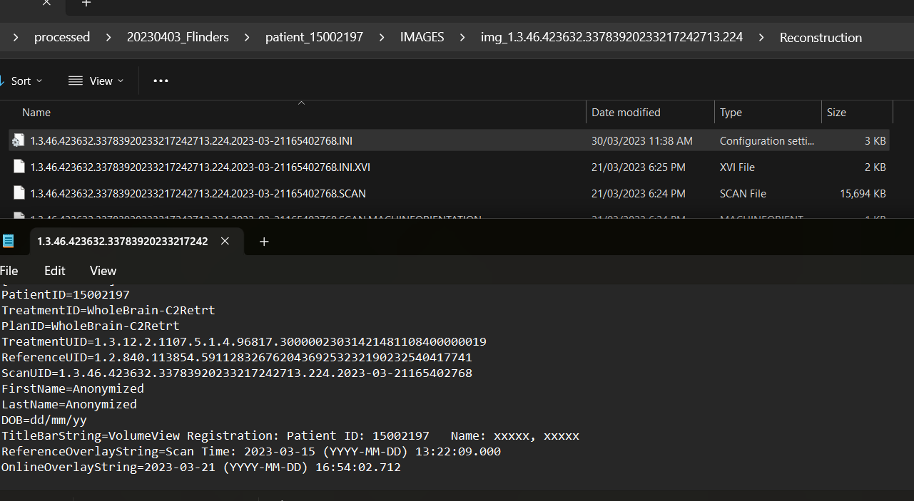
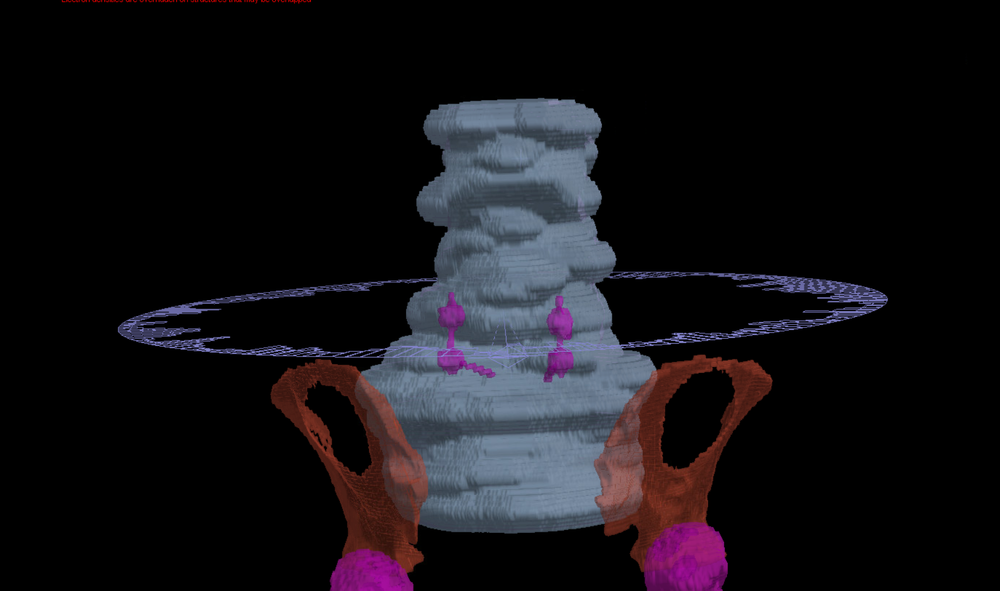
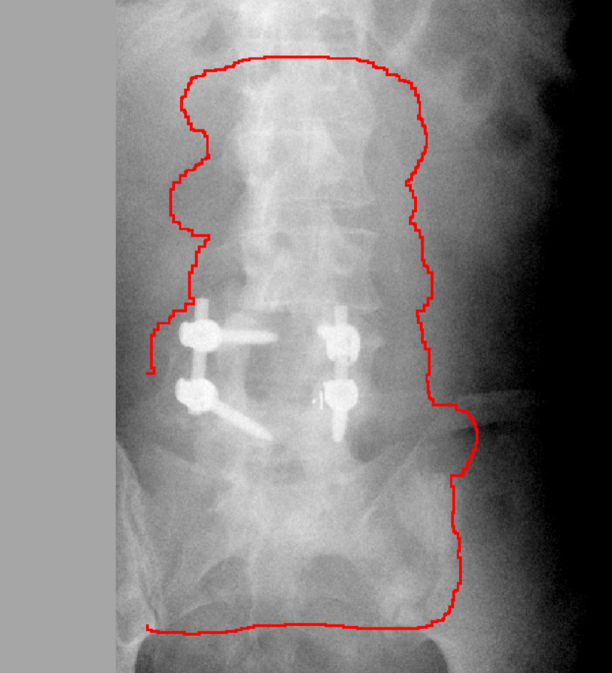
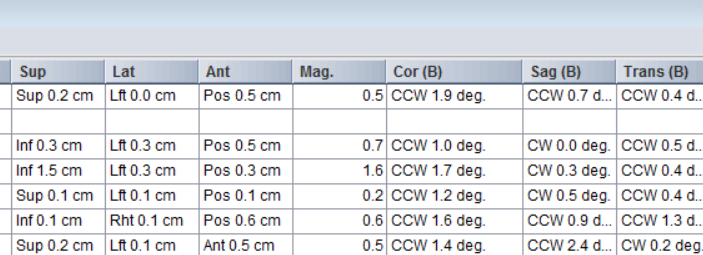
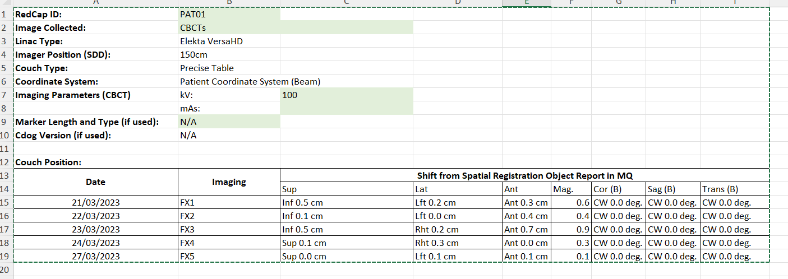
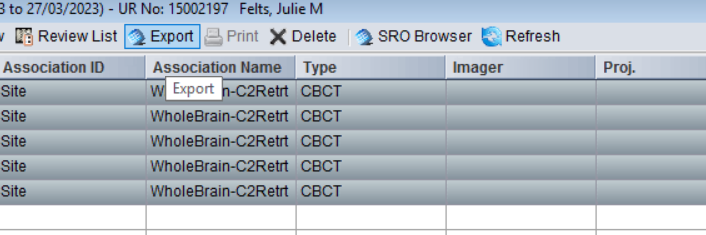
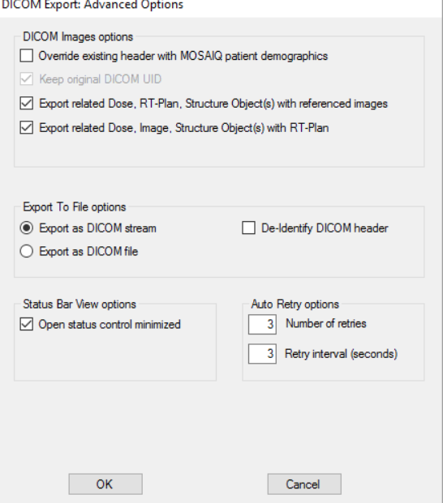
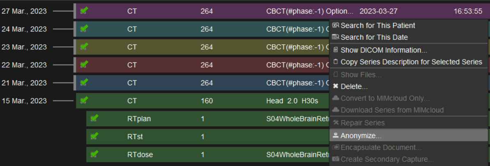
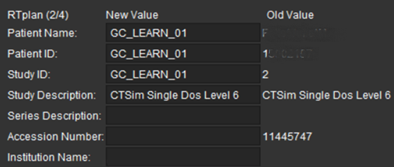
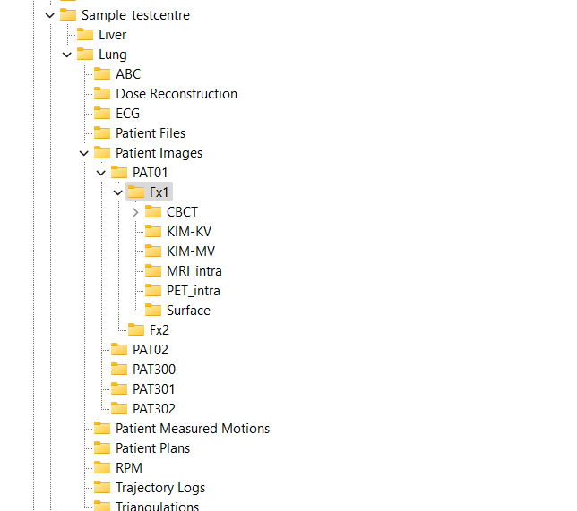

# GC Elekta Patient Upload Process to USYD RDS/research/PRJ-LEARN

## Purpose of document

This document serves as the SOP for patient data transfer to LEARN from PRIME datastore and from the Elekta_fdt datastore. This is to be used in conjunction with the USYD transfer WIs which addresses connectivity and folder structure in more detail.

Before registering the patient we need to check if dataset has the following:

1. Height/weight information in MQ assessments (Vital Signs) during the treatment period. This requirement might be revisited at a subsequent revision.
2. Projections with target within the 180 degree frames.
3. RPS.dcm with registration and shift values available in XVIclinical folder and MQ

## PRIME Data Transfer

The Site Physicist of each PRIME site will move PRIME related data to [PRIME Data Store](https://genesiscare.sharepoint.com/:f:/r/sites/PRIME/Shared%20Documents/PRIME%20Data%20Store?csf=1&web=1&e=mhtCbJ).

The PRIME trial physicist will be responsible for the rest of the process below. Only the sessions with SFOV CBCTs need to be transferred to the LEARN data base. Ignore sessions with MFOV CBCTs.

<**to be expanded**/copy from PRIME workflow doc>

## Elekta_fdt Data Transfer

Open up the [Patient Data Log.xlsx](https://genesiscare.sharepoint.com/:x:/r/sites/LEARN/Shared%20Documents/General%20Channel/Patient%20Data%20Log.xlsx?d=w2ebf6abe06d542cb9e87b3c40fd1beea&csf=1&web=1&e=XmStjS) in LEARN Teams. This is a list of patients in the Elekta_FDT folder. Go to the patient folder in elekta_fdt that is currently being processed and select an unprocessed patient on the worksheet.

elekta_fdt folder name contains the MRN. Open patient in Mosaiq.

Scan UID of the CBCT has date and time embedded in it. One place to get it is in one of the .ini files in IMAGES\img_1.3.46.423632.337839202332931827841.8\Reconstruction

Date and time of CBCT:
ScanUID=1.3.46.423632.33783920233217242713.224.2023-03-21165402768

Open patient in Mosaiq and find out what the treatment was, check if there are registration shifts have been uploaded as required into MQ. If there are shifts then go to the patient plan in Monaco.

In the folder structure of export from XVI this scan UID it is in one of the .ini files in IMAGES\img_1.3.46.423632.337839202332931827841.8\Reconstruction

Open patient in Monaco. If not in the default location, retrieve from archive (ensuring the usual precautions for retrieval is followed so it doesn't overwrite any data). Open the correct plan (using the date and reference meta-data of first fraction CBCT) and open 3D view with PTV visible.

## Target in projections check

Open **Contour Alignment Tool** from imageX and follow instructions in [https://github.com/Image-X-Institute/contour-alignment-tool.git](https://github.com/Image-X-Institute/contour-alignment-tool.git) to get to view the contour overlayed on projections. Use 3D view in Monaco to verify and adjust contour location against the projections.

 

All the data loads fine and goes green, gets to Data processing in progress, Loading the CT happens quickly. "Generate structure volume mask" takes a long time. Looks like it's stalled but it has not.

To assess whether the PTV is within the target,

1. Check image is SFOV (come back MFOV images if more patients are needed)
2. Open up patient in Monaco in 3D view and at the same time have the contour alignment tool open. Use both to guide where the PTV will be on the patient anatomy.

## Patient Details and shifts from Mosaiq Images List

Open the excel template for Treatment Notes

kV and mA per frame can be obtained from the .ini in the reconstruction folder. mAs ??

TubeMA=10.0000 TubeKV=100.0000

Coordinate system will be "Patient Coordinate System (Beam)". See Appendix to check if beam or anatomy.

The image list SRO browser can be used to fill the shift in patient coordinates.

The registration results applied and shifted to and from that fraction's CBCT is listed here in patient coordinates. You can highlight and copy these values to the patient details spreadsheet.

Export CBCTs to MIM for anonymisation.:

If on another state's MIM and you don't have access to those network shares, you might have to export to MIM NSW or MIM Test and then anonymise and export to file from there.

## Anonymisation in MIM

All projection and CBCT files in elekta_fdt are already anonymised. TPS data will need to be exported and anonymised. Export plan and include reference images to SNC_DICOM from TPS. Open the folder in MIM. Right click and select anonymize

Use the Sequential ID name from the patient list worksheet (this.

Export to folder in SNC_DICOM or a folder accessible to MIM.

## Transfer

Instructions [LEARN data collection15May2025.pdf](https://genesiscare.sharepoint.com/:b:/r/sites/LEARN/Shared%20Documents/General%20Channel/LEARN%20data%20collection15May2025.pdf?csf=1&web=1&e=YIrMxY)

Use the SFTP (cyberduck or WinSCP) to connect and place files in LEARN folder as per folder structure specified in the Sample_testcentre.

Check the actual folder in LEARN as the recommended structure might have been updated since the time of screen shot below.

GC is only providing CBCTs at this stage so the reconstructed CBCTs, registration objects and the projection files will be in the PATxx >> FXxx > CBCT folder. **Only include the CBCTs on which shifts were applied and treated.**

## Appendix

### Definitions from Mosaiq 2.83 help file

**Images list column definitions.**

| Parameter | Description |
|-----------|-------------|
| Sup | Displays the magnitude of the superior or inferior offset of the image in centimeters. |
| Lat | Displays the magnitude of the left or right offset of the image in centimeters. |
| Ant | Displays the magnitude of the anterior or posterior offset of the image in centimeters. |
| Mag. | Displays the offset vector magnitude. |
| Cor (B) | Displays the coronal angular correction in degrees. |
| Sag (B) | Displays the sagittal angular correction in degrees. |
| Trans (B) | Displays the transverse angular correction in degrees. |

**Setup Offset Reference**

Select the offset reference to be used by Image Management. Setup corrections on images are described in patient coordinates (Ant/Post, Sup/Inf, R/L). You can select Beam or Anatomy to determine the direction in which to move the beam. These selections configure the MOSAIQ system to show setup corrections direction relative to beam parameters or patient anatomy shown in the image.

The settings are opposite of each other. If you move the patient in the inferior direction, the isocenter moves in the superior direction.

If you select Beam, offsets show the direction the displayed isocenter/aperture must move across the displayed anatomy to align with the planned target position. If you select Anatomy, offsets show the direction the patient must move below the immobile beam. The default is Beam.

These options configure the system to show setup corrections direction relative to beam parameters or patient anatomy viewed in the image.

- **Beam:** The direction the current beam references (jaw/isocenter) must move to align with the target anatomy.
- **Anatomy:** The direction target anatomy shown in the image must move to align with the displayed beam references.

Department configuration for Setup Offset Reference at GC is **Beam**.

