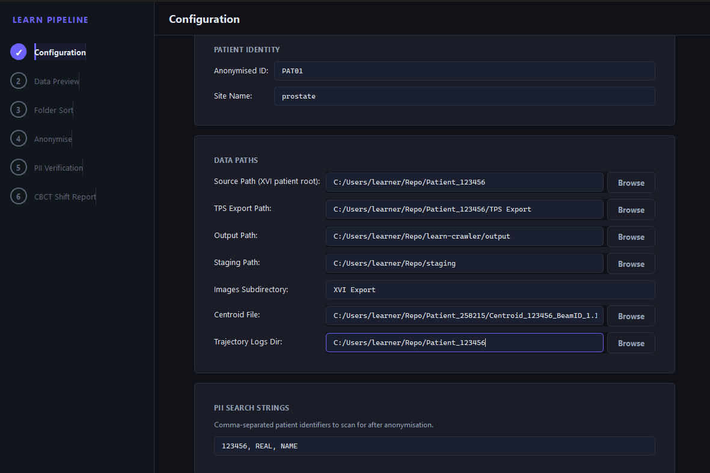
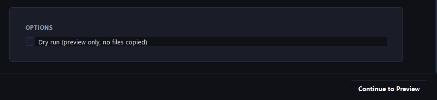
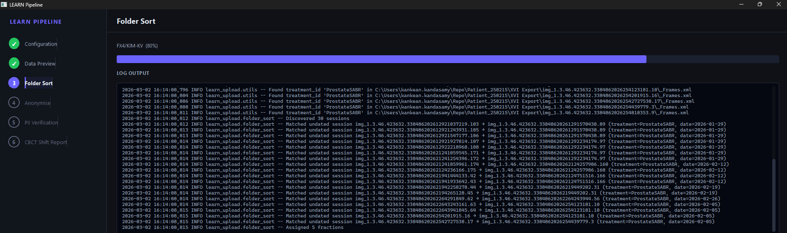
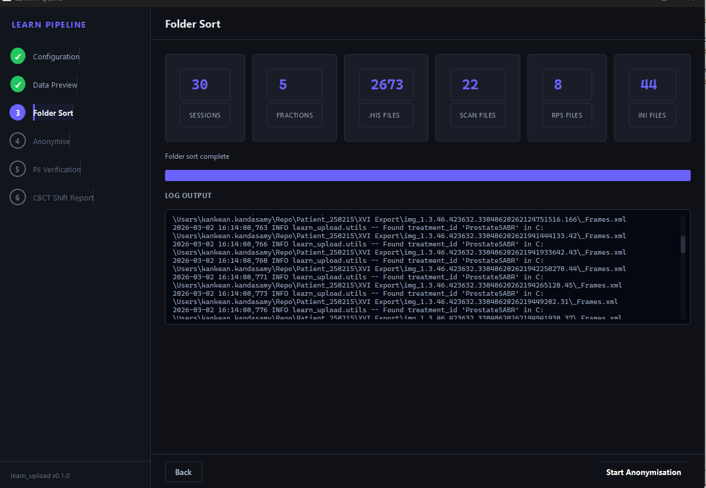
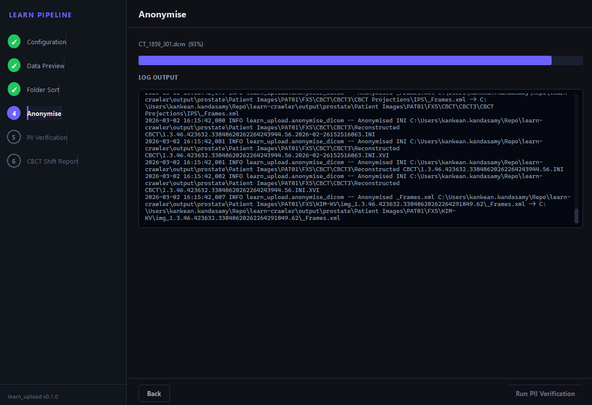
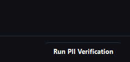
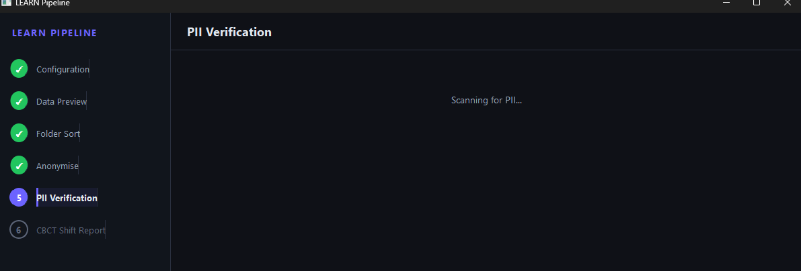
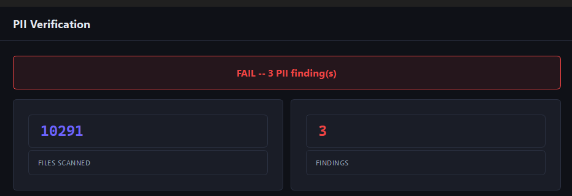
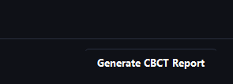

# LEARN Pipeline GUI Walkthrough

## Purpose

The LEARN Pipeline GUI is a 6-step desktop wizard that automates the transfer of Elekta XVI CBCT patient data from GenesisCare exports to the USYD RDS/research/PRJ-LEARN directory structure. It replaces the manual workflow documented in the [GC Elekta Patient Upload Process](GC_Elekta_Patient_Upload_Process.md) with a guided, reproducible process covering folder sorting, DICOM anonymisation, PII verification, and CBCT shift reporting.

## Prerequisites

- **Python 3.10+** with the following packages installed:
  ```
  pip install pydicom PyQt6
  ```
- Access to the XVI patient export directory (e.g. `\\GC04PRBAK02\elekta_fdt\XVI_COLLECTION\processed\`)
- A writable output directory for the LEARN folder structure

## Launching the GUI

```bash
python -m learn_upload
```

The window opens with a dark-themed interface. A sidebar on the left shows all six steps; the main panel on the right displays the active step. Completed steps get a green checkmark in the sidebar and can be clicked to review.

---

## Step 1: Configuration

The Configuration page collects all the parameters needed for the pipeline run. It is divided into four cards.

### Patient Identity

| Field | Description |
|-------|-------------|
| **Anonymised ID** | The PATxx identifier for this patient (e.g. `PAT01`). Must match the format `PATxx` where `xx` is a two-digit number. |
| **Site Name** | The treatment site label used as a subfolder in the output (e.g. `prostate`). |

### Data Paths

| Field | Description |
|-------|-------------|
| **Source Path** | Root of the XVI patient export (e.g. `Patient_258215`). Contains the `IMAGES/` or `XVI Export/` subdirectory. |
| **TPS Export Path** | Path to exported treatment planning system DICOM files (optional). |
| **Output Path** | Root output directory where the LEARN folder structure will be created. |
| **Staging Path** | Intermediate staging directory. Defaults to `output/_staging` if left blank. |
| **Images Subdirectory** | Name of the images folder within the patient export. Defaults to `XVI Export`. |
| **Centroid File** | Path to a centroid CSV file for KIM data (optional). |
| **Trajectory Logs Dir** | Directory containing trajectory log files (optional). |

### PII Search Strings

A comma-separated list of patient identifiers (MRN, name fragments, etc.) that will be searched for during the PII verification step. The patient's MRN is also auto-detected from the source directory name.

### Options

- **Dry run** -- When checked, the folder sort step previews the file operations without copying any files.





Once all required fields are filled in, click **Continue to Preview** to proceed.

---

## Step 2: Data Preview

After submitting the configuration, the GUI discovers all imaging sessions within the source directory. A table displays the results with the following columns:

| Column | Description |
|--------|-------------|
| **Type** | Session type (e.g. `cbct`, `planar`). |
| **Directory** | The `img_` directory name containing this session. |
| **Datetime** | Scan date and time extracted from the ScanUID. |
| **Treatment** | Treatment plan ID parsed from `_Frames.xml`. |
| **kV** | Tube voltage from the reconstruction INI file. |
| **mA** | Tube current from the reconstruction INI file. |
| **RPS** | Whether an RPS registration file was found for this session. |

A stat card above the table shows the total number of discovered sessions.

Review the table to confirm the expected sessions are present, then click **Start Folder Sort** to proceed.

> *Screenshot to be added.*

---

## Step 3: Folder Sort

The folder sort step copies files from the XVI export into the LEARN directory structure, organising them by fraction and file type.

During execution, a progress bar shows the current operation (e.g. `FX4/KIM-KV`) and percentage. The log output panel displays real-time messages including treatment ID discovery from `_Frames.xml` files and session-to-fraction matching.



When complete, stat cards display a summary of the sorted data:

| Stat | Description |
|------|-------------|
| **Sessions** | Total imaging sessions processed. |
| **Fractions** | Number of treatment fractions identified. |
| **.his Files** | Projection image files copied to KIM-KV folders. |
| **SCAN Files** | Reconstructed CBCT scan files copied. |
| **RPS Files** | Registration Position Storage DICOM files copied. |
| **INI Files** | Reconstruction parameter files copied. |



Click **Start Anonymisation** to proceed.

---

## Step 4: Anonymise

The anonymisation step processes all DICOM, XML, and INI files in the output directory, replacing patient-identifiable information with the anonymised ID.

A progress bar tracks the current file being processed (e.g. `CT_1859_301.dcm`) and the overall percentage. The log output shows each file as it is anonymised, including the source and destination paths.



When complete, stat cards show:

| Stat | Description |
|------|-------------|
| **DICOM** | Number of DICOM files anonymised. |
| **XML** | Number of `_Frames.xml` files anonymised. |
| **INI** | Number of INI configuration files anonymised. |
| **TPS Imported** | Number of TPS export files imported and anonymised. |
| **Errors** | Number of files that failed to anonymise (highlighted in red if > 0). |



Click **Run PII Verification** to proceed.

---

## Step 5: PII Verification

The PII verification step scans all files in the output directory for any residual patient-identifiable information matching the search strings configured in Step 1. The MRN extracted from the source directory name is automatically included.



The result is displayed as either **PASS** (green banner) or **FAIL** (red banner), along with stat cards showing the number of files scanned and the number of findings.



If findings are detected, a table lists each one with:

| Column | Description |
|--------|-------------|
| **File** | Relative path to the file containing PII. |
| **Location** | Where in the file the match was found (e.g. DICOM tag name, XML element). |
| **Matched** | The PII string that was matched. |

If the result is FAIL, you should investigate and resolve the findings before uploading to LEARN. Common causes include PII embedded in private DICOM tags or XML metadata that was not covered by the anonymisation rules.



Click **Generate CBCT Report** to proceed.

---

## Step 6: CBCT Shift Report

The final step generates a markdown report of CBCT couch shifts extracted from the RPS registration files. The report is displayed in a text viewer and automatically saved to the `Patient Files/PATxx/` folder as `cbct_shift_report.md`.

The report includes per-fraction registration shifts in patient coordinates, which can be cross-referenced with Mosaiq image list values for quality assurance.

If no RPS files are found in the output directory, an error message is shown instead.

Once the report is generated, click **New Patient** to reset the wizard and start processing the next patient.

> *Screenshot to be added.*
